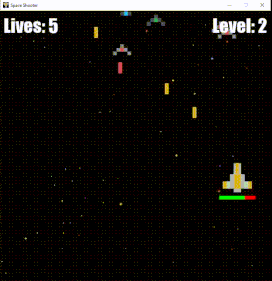

# Space Shooter Game

Welcome to the Space Shooter Game, an exhilarating Python game implemented using the Pygame library.



## Table of Contents
- [Description](#description)
- [Features](#features)
- [How to Play](#how-to-play)
- [Controls](#controls)
- [Installation](#installation)
- [Usage](#usage)
- [Customization](#customization)
- [High Score](#high-score)
- [License](#license)
- [Acknowledgments](#acknowledgments)

## Description

Space Shooter Game is a thrilling space-themed Python game where you take control of a spaceship to combat enemy ships and survive through various levels. Dodge enemy fire, shoot lasers, and challenge yourself to reach the highest level!

## Features

- **Intense Gameplay:**
  - Engage in fast-paced space battles with enemy ships.

- **Challenging Levels:**
  - Progress through levels with increasing difficulty, testing your skills and reflexes.

- **Interactive Controls:**
  - Easily control your spaceship using intuitive keyboard controls.
 
- **Interactive Controls:**
  - Original 8-bit BGM and SFX to recreate the arcade experience.

## How to Play

1. **Controls:**
   - Use the WASD keys to move your spaceship.
   - Press the spacebar to shoot lasers and eliminate enemy ships.
   - Dodge enemy lasers to avoid taking damage.

2. **Objective:**
   - Survive as long as possible, defeating enemy ships and progressing through levels.

## Controls

- **WASD keys:** Move your spaceship.
- **Spacebar:** Shoot lasers.

## Installation

1. Clone the repository:

   ```bash
   git clone https://github.com/yourusername/space-shooter.git
   cd space-shooter
   ```
2. Install Pygame:
   ```bash
   Copy code
   pip install pygame
   ```

## Usage

Run the game using the following command:
```bash
python space_shooter.py
```

## Customization
Feel free to customize the game by modifying the code. You can adjust variables, add new features, or change the visual elements to make it your own.

## License
This project is licensed under the MIT License.

## Acknowledgments
Pygame for providing a powerful framework for game development in Python.
Special thanks to Tech With Tim for the many educational Youtube videos he has made.
